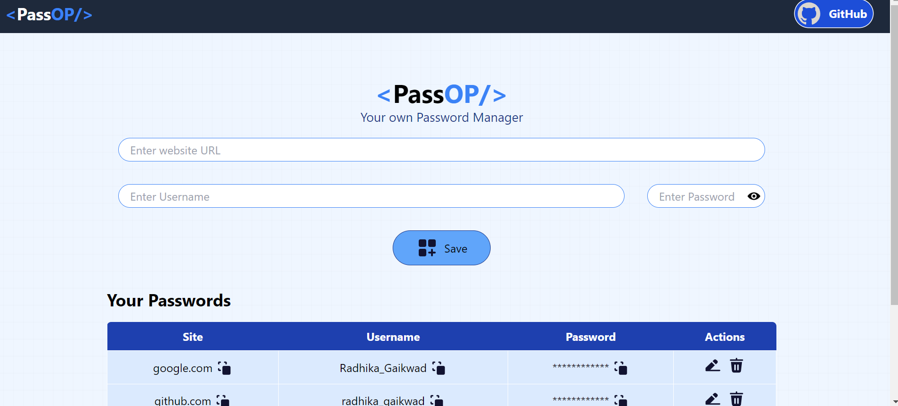

# Passop - Password Manager



## Project Overview
**Passop** is a secure and user-friendly password manager application built using React, HTML, and Tailwind CSS. This application helps users to store, manage, and retrieve their passwords effortlessly.

## Features
- **User Authentication**: Secure login and registration for users.
- **Password Storage**: Save and manage passwords for various accounts.
- **Password Generator**: Generate strong, random passwords.
- **Search Functionality**: Easily search for saved passwords.
- **Responsive Design**: Mobile-friendly interface for easy access on the go.

## Technologies Used
- **React**: A JavaScript library for building user interfaces.
- **HTML**: Standard markup language for creating web pages.
- **Tailwind CSS**: A utility-first CSS framework for styling.

## How to Run the Project
1. **Clone the repository**:
    ```bash
    git clone https://github.com/your-username/passop.git
    cd passop
    ```

2. **Install dependencies**:
    ```bash
    npm install
    ```

3. **Set up environment variables**:
    Create a `.env` file in the root directory and add necessary environment variables.

4. **Run the project**:
    ```bash
    npm start
    ```

5. **Access the project**:
    Open your browser and go to `http://localhost:3000`

## Contributing
1. Fork the repository.
2. Create a new branch (`git checkout -b feature-branch`).
3. Make your changes.
4. Commit your changes (`git commit -m 'Add new feature'`).
5. Push to the branch (`git push origin feature-branch`).
6. Open a Pull Request.

## License
This project is licensed under the MIT License.
